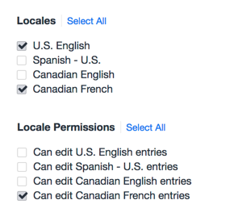

# Craft CMS Locale Permissions

Extend Craft permissions on multilingual locale sites. Allow content editors to view locale entries without being able to edit them, great for handling translations.

## How To Use
Create a new locale specific user group (or apply directly on users). Use the default 'Locales' section of the user group permissions to allow editor access to localized content. Set the Entry, Category and Global permissions for the locale. Use the 'Locale Permissions' section to set edit permissions on specific locales. 

Assign users to the locale user group you create or set permissions on a user by user basis.